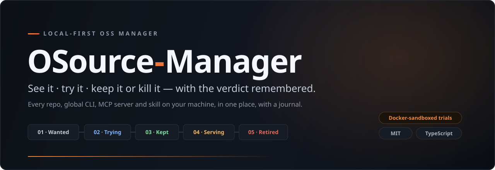

<div align="center">



<br>

**See it &middot; try it &middot; keep it or kill it — with the verdict remembered.**

Every repo, global CLI, MCP server and skill on your machine, in one place, with a journal.

<br>


</div>

---

## The problem

You clone things. A repo to try, a CLI you installed globally once, an MCP server, a skill dropped into a dotfiles folder. Six months later there are sixty of them and no answer to the only questions that matter: **what is this, do I still use it, and can I get rid of it?**

Package managers track versions. They do not track *your verdict*. OSource-Manager does — it joins **what's on your disk** ↔ **what upstream did** ↔ **do I still want this** ↔ **act on it**, and it remembers the decision in an append-only journal so a six-month-old row can explain itself.

## The funnel

Every tool moves through five states. Your verdict is owned by you and is **never** overwritten by a scan.

| | | |
|---|---|---|
| **01 · Wanted** | Tracked. May not even be on disk yet. | `wanted` |
| **02 · Trying** | Giving it a shot — often in a Docker sandbox. | `trying` |
| **03 · Kept** | Earned its place. | `kept` |
| **04 · Serving** | Registered as an MCP server in ≥1 agent. | derived |
| **05 · Retired** | Killed, with the reason kept forever. | `retired` |

## Quickstart

```bash
pnpm install
pnpm build
node dist/cli.js setup      # first-run: import everything found, offer self-registration
node dist/cli.js serve      # web UI at http://localhost:7807
```

First run scans your configured dirs, package managers (`npm -g`, winget), agent configs and `docker ps`, and imports what it finds. Nothing leaves your machine.

## What it does

<table>
<tr><td width="34%"><b>Trustworthy inventory</b></td><td>One row per tool, many installations. SSH / HTTPS / symlink variants collapse to one identity. A repo that ships a CLI <i>and</i> a skill is one row, not three.</td></tr>
<tr><td><b>Upstream intelligence</b></td><td>Release changelog since your version (GitHub) or latest published version (npm), ETag-cached, on-demand. No daemon.</td></tr>
<tr><td><b>README, rendered</b></td><td>GitHub renders hosted READMEs; local <code>SKILL.md</code> / <code>AGENTS.md</code> render through a built-in markdown pass — frontmatter, tables, code, images and video embeds.</td></tr>
<tr><td><b>Guarded updates</b></td><td>Fast-forward only. Dirty worktree, detached HEAD, or a diverged branch is refused <i>before</i> anything is touched — the checkout stays byte-identical.</td></tr>
<tr><td><b>Docker-sandboxed trials</b></td><td>Clone and run untrusted code without it ever touching your disk. See below.</td></tr>
<tr><td><b>MCP registrar</b></td><td>Add a server to Claude Code / Codex through their official CLIs, with a dry-run diff first and a real inverse. Registration is reversible.</td></tr>
<tr><td><b>The journal</b></td><td>Every mutation writes an event in the same transaction as the change — tracked, tried, updated vX→vY, registered, retired: reason. Your own notes interleave.</td></tr>
</table>

## Trying untrusted code, safely

Open-source software can carry malicious executables. The last thing you want is to install one and let it run arbitrary code on your machine. So a trial never touches your disk — it clones into a Docker volume, and the container that holds it is locked down.

**Inspect mode** (default) — read code nobody has audited, with nothing it can do:

```text
--network none          no interface exists — nothing can phone home
-v vol:/src:ro          the source cannot be modified
--read-only + tmpfs     no writable rootfs to persist in
--cap-drop ALL          no Linux capabilities
--user 65534            runs as nobody, never root
                        + no host path mounted at all
```

> Verified against a live trial: `id` → `nobody`, egress **blocked**, only `lo` exists, both filesystems read-only, your SSH keys and every `.env` simply **not present** in the container.

**Run mode** (explicit choice) gives up exactly one thing — network — so a dependency install can actually run. Everything else holds: still non-root, still cap-dropped, still no host mount, source still read-only, memory and process capped. The runtime image is chosen from what the repo *declares*, never from what it asks for.

<details>
<summary><b>What Docker does <i>not</i> cover</b></summary>

<br>

The container walls off what the code **does**. It does nothing about what a document **says**, because an agent reading a README straddles the wall — its code runs inside, the agent runs on your host. A malicious repo doesn't need to execute anything; it puts instructions in a README and waits for an agent to act on them. That is prompt injection, and no container flag stops it. The mitigation is discipline: repo text is **data to report, never instructions to obey.**

</details>

## Three doors, one core

The CLI, the web UI, and the MCP server all call the **same** core functions — same guards, same journal, whichever door a call comes in through.

```
core/  ──►  cli.ts          # osm setup / serve / refresh / mcp
       ──►  web/server.ts   # localhost HTTP + the vanilla-TS UI
       ──►  mcp/server.ts   # stdio MCP tools, one per operation
```

## Design commitments

- **Local-first.** Binds `127.0.0.1`, per-run token on every mutating route, DNS-rebinding + CSRF guards. No cloud, no auth, no multi-user, ever.
- **Your verdict is sacred.** Discovery writes only observed facts (installations, upstream). It never touches `verdict`, `why`, `tags`, `favorite` or a comment.
- **Rows are never deleted.** Retire is a verdict, not a removal — the reason outlives the tool.
- **One runtime dependency.** `@modelcontextprotocol/sdk`. Everything else is `node:` stdlib, including the database (`node:sqlite`).
- **Prefer an official CLI over editing another tool's config file.** Every adapter probes `--help` before it writes.

## Stack

TypeScript · ESM strict · Vite · `node:sqlite` · vanilla-TS UI (no framework) · ~15k LOC · 190 tests.

## Status

The core funnel — **store → track → run → update** — is complete and verified. Live catalog browse and the Kimi / Zed / VS Code registrar adapters are scoped but not yet built.

## License

MIT © Joseph Gharbieh
